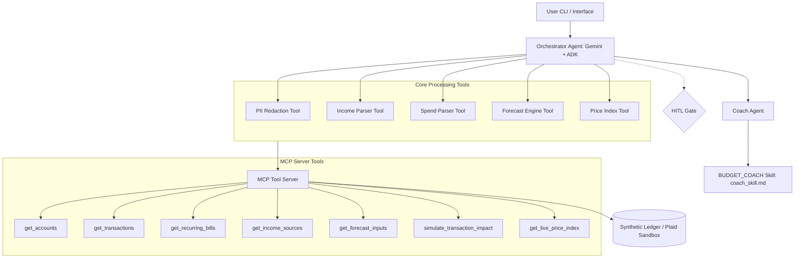

# Ahead

Ahead is a personal finance early warning system that detects gradual overspending and estimates near-term overdraft risk before it happens.

Built as the capstone project for the Google 5-Day AI Agents Intensive.

## Table of Contents
* [Overview](#overview)
* [The Problem](#the-problem)
* [Why an Agent?](#why-an-agent)
* [Architecture](#architecture)
* [Course Concepts Applied](#course-concepts-applied)
* [Performance](#performance)
* [Setup](#setup)
* [Security](#security)

---

## Overview

Ahead forecasts future cash flow instead of only reporting past spending. It answers two questions before a purchase is made:
1. **Am I likely to overdraft before my next paycheck?**
2. **Can I afford this purchase right now?**

Forecasts are generated with a 14-day Monte Carlo simulation using historical spending patterns.

| Feature | Traditional Apps | Ahead |
| :--- | :---: | :---: |
| Historical transaction tracking | ✅ | ✅ |
| Cash flow forecasting | ❌ | ✅ |
| Overdraft risk estimation | ❌ | ✅ |
| Spending pattern detection | ❌ | ✅ |
| Purchase simulation | ❌ | ✅ |
| Inflation-adjusted forecasting | ❌ | ✅ |
| Coaching personas | ❌ | ✅ |
| Read-only financial access | ⚠️ Varies | ✅ |

---

## The Problem

Most financial problems develop gradually rather than from a single large purchase.

Two common situations are:
* **Near-term overdraft:** A few ordinary purchases made before rent or other bills clear leave the account overdrawn.
* **Gradual overspending:** Monthly spending consistently exceeds income by a small amount, slowly reducing savings until debt becomes unavoidable.

Most budgeting apps report what already happened. Ahead estimates what is likely to happen next.

---

## Why an Agent?

A single model call cannot securely retrieve financial data, sanitize sensitive information, run simulations, and explain the results. Those responsibilities are separated across multiple components.

Ahead consists of two agents:
* **Orchestrator Agent** handles user requests, retrieves data, runs forecasting tools, and coordinates the workflow.
* **Coach Agent** converts forecast results into user-facing guidance using predefined coaching skills.

Ahead runs automatically whenever transaction data changes. New transactions trigger updated forecasts, cash runway calculations, and coaching recommendations.

Deterministic tasks remain outside the language model:
* **Income Parser** identifies pay schedules and income from transaction descriptions.
* **Spend Parser** identifies recurring bills and subscriptions.
* **Forecast Engine** performs a 14-day Monte Carlo simulation using bootstrapped discretionary spending from historical transactions and supports category-specific inflation adjustments.
* **Refuel Predictor** detects recurring discretionary purchases, such as fuel, projects future occurrences, and incorporates them into the forecast.
* **PII Redactor** removes account numbers, routing numbers, credit card numbers, and Social Security numbers before data reaches the model.
* **Commodity Price Tool** retrieves current fuel and grocery price indexes used during forecasting.

---

## Architecture



---

## Course Concepts Applied

Ahead incorporates the concepts covered in the Google AI Agents Intensive.

* **Multi-agent architecture:** Built with the Google ADK. The Orchestrator routes requests, executes tools, and delegates user communication to the Coach Agent.
* **MCP Server:** Exposes seven read-only tools for retrieving financial data, forecasting, simulations, and price indexes.
* **Antigravity:** Used to design and validate the backtesting workflow and debug agent interactions.
* **Security:** Financial data remains local, PII is removed before model calls, MCP tools are read-only, and user approval is required before notifications.
* **Deployment:** Containerized with Docker and deployable locally or on Vertex AI Agent Engine.
* **Agent Skills:** The Coach Agent loads reusable skill files that define coaching style and safety behavior.

---

## Performance

The forecasting engine was evaluated using a lookahead-free backtest over 63 historical evaluation points.

| Metric | Value |
| :--- | :--- |
| Brier Score | 0.1379 |
| Overdraft Recall | 60.0% |
| False Alarm Rate | 18.6% |
| Evaluation Points | 63 |

### Calibration

| Predicted Risk | Observed Overdraft Rate | Samples |
| :--- | :---: | :---: |
| 0-20% | 16.7% | 48 |
| 20-40% | 0.0% | 3 |
| 40-60% | 100.0% | 1 |
| 80-100% | 100.0% | 2 |

The higher-risk bins contain only three total observations, so those estimates should be interpreted cautiously. The results are directionally consistent but limited by sample size.

---

## Setup

### Prerequisites
* Python 3.10+
* Gemini API key

### Installation
```bash
git clone <repository_url>
cd capstone
pip install -e .
```

### Configuration
Create `.env` based on `.env.example`:
```bash
cp .env.example .env
# Edit .env to set:
# GEMINI_API_KEY=your_api_key
```

### Run the Backtest
```bash
python run_backtest.py
```

### Run the CLI
```bash
python -m src.main --ask "Can I afford a $250 flight right now?"
```

---

## Security

* Financial data remains on the local machine.
* Account numbers, routing numbers, credit card numbers, and Social Security numbers are removed before model requests.
* The MCP server is read-only and cannot move money or modify accounts.
* User approval is required before notifications or other actions.
